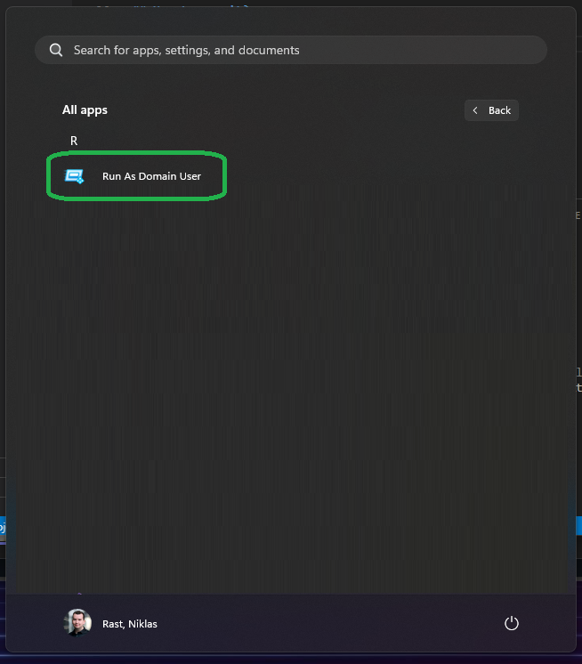
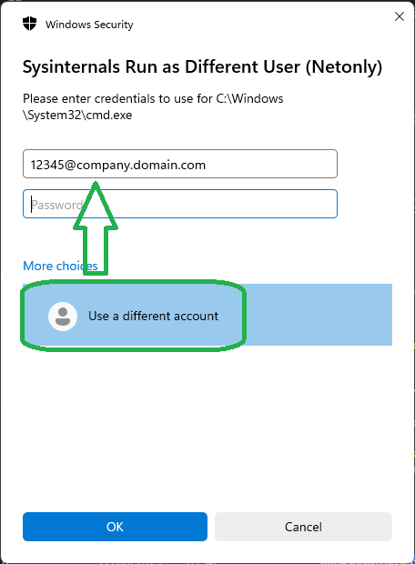

# 🛫 Run as Domain User (from Non-Domain-Joined devices) 🛫

This app acts as a wrapper to run ShellRunas.exe with predefined parameters to execute cmd.exe invoked as an onprem account from the AD. It can help when you went Cloud-Only with you Windows devices but need to use legacy tools like the RSAT Tools to manage you onprem domain.

## Prerequisites

### Network
The Client needs network Connectivity to Domain Controllers to validate the credentials.

### Domain Name
Replace `company.domain.com` in the `domain.txt` file with your full domain name.

### App Name
Replace `C:\Windows\System32\cmd.exe` in the `app.txt` file with the app that you want to run with the privileged of an active directory user, or leave it if it fits your needs. The file must be inserted with the full path and all file extensions.

### Intune Package
Use the [Microsoft Win32 Content Prep Tool](https://github.com/microsoft/Microsoft-Win32-Content-Prep-Tool) to create a `.INTUNEWIN` file from the solution, then upload it to Intune and assign it to devices.

Use the following details for the Intune package:

Install: `C:\Windows\SysNative\WindowsPowershell\v1.0\PowerShell.exe -ExecutionPolicy Bypass -Command .\INSTALL-RunAsDomainUser.ps1 -install`

Uninstall: `C:\Windows\SysNative\WindowsPowershell\v1.0\PowerShell.exe -ExecutionPolicy Bypass -Command .\INSTALL-RunAsDomainUser.ps1 -uninstall`

Detect (FILE): `"C:\ProgramData\RunAsDomainUser\runasdomainuser-exe.exe"`

## How to use it?

Once the app is installed on your Windows device(s) look in the Windows start menu for `Run As Domain User`:

When clicking on the app it launches a "UAC"-like prompt to authenticate with a user account that exists in the domain that you defined inside of `domain.txt`:

Authenticate using a full FQDN like `12345@company.domain.com` from the `Use a different account` selection.

After successfully authenticated, the in `app.txt` defined executable should launch and run with the permissions from the defined user from active directory which lives in the domain that you defined in `domain.txt`.

---

Made with ❤️ by [Niklas Rast](https://github.com/niklasrst)
